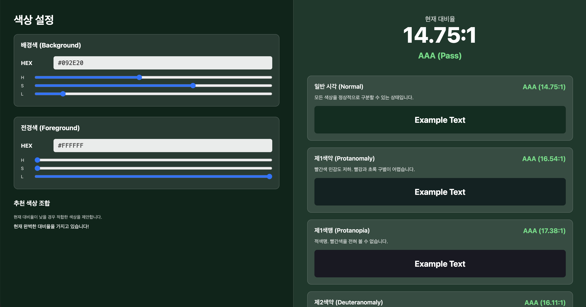
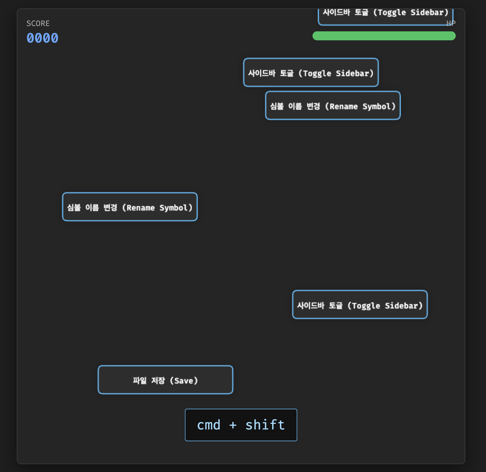
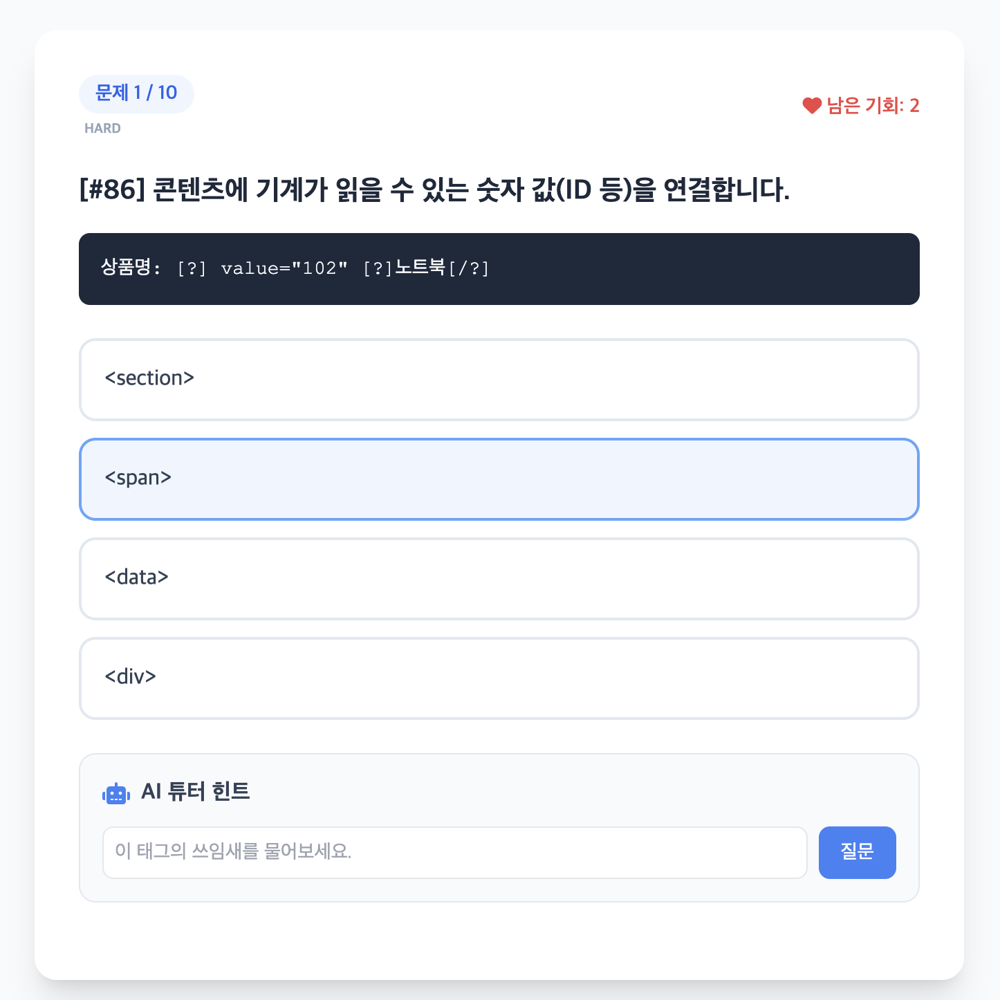
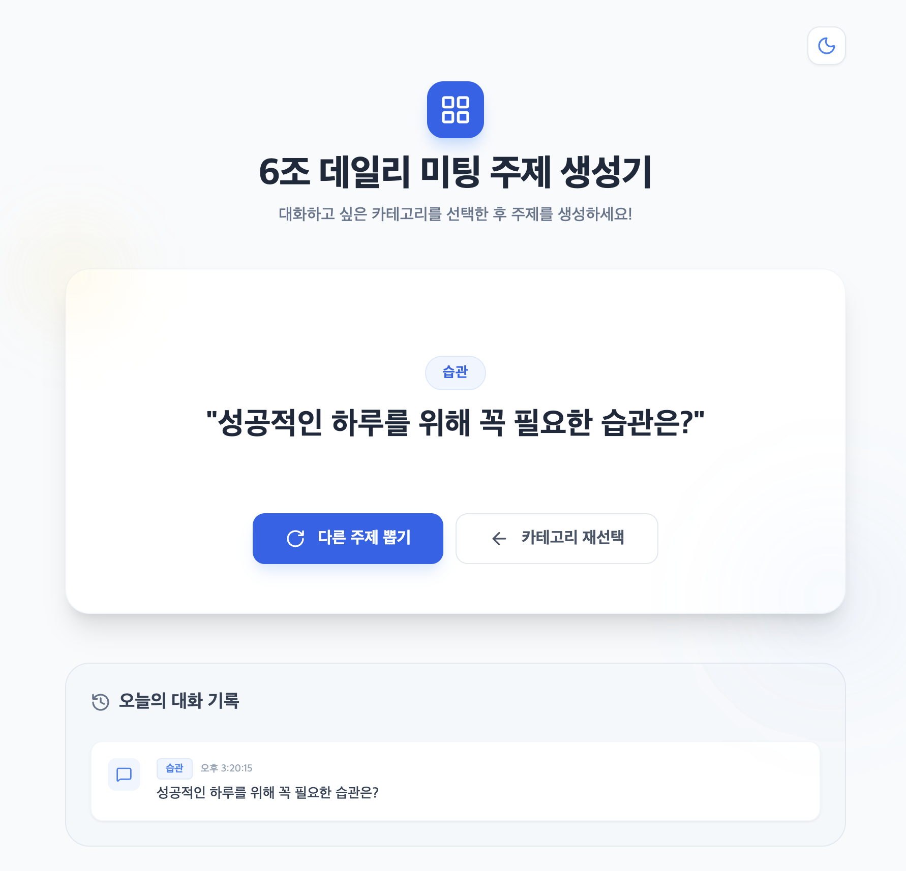

# gemini-canvas-mission

Gemini Canvas 미션 결과물을 관리하는 저장소입니다.

## 목적

- Gemini Canvas로 제작한 웹앱 결과물을 기록하고 공유합니다.
- 앱별 요구사항, 배포 링크, 회고를 일관된 형식으로 남깁니다.

## 내가 만든 앱 🎮

### WCAG 색상 대비 체크 앱(Utility)

전경색과 배경색을 입력하여 색상대비가 WCAG 기준에 충족되는지 확인할 수 있는 앱입니다.
만약 WCAG 기준에 충족되지 못할시 기준에 충족하는 색상을 추천해 줍니다.

 

 

> **목표 ✨**

웹 접근성을 충족하기 위해 색상대비를 확인하고 적절한 색상을 사용하여 모두가 동일한 경험을 할 수 있도록 노력합니다.

---

### VSCode 커맨드 마스터 게임(Game)

게임 시작시 VSCode 커맨드를 사용하여 수행할 수 있는 동작이 블럭인 형태로 내려옵니다.
해당 블럭은 바닥에 닿기전에 제거해야합니다.
제거하려면 수행할 수 있는 동작과 일치하는 커맨드를 입력해야합니다.

 

 

> **목표 ✨**

VSCode IDE를 처음접하거나 아직 커맨드 사용에 익숙하지 않은 사용자들을 대상으로 커맨드 사용 실력을 향상시켜 효율적인 개발 생산성을 갖추도록 합니다.

---

### HTML 시멘틱 태그 마스터 학습(Learn)

HTML에서 특정 부분 또는 상황에 어떤 태그가 사용되어야 하는지에 관하여 문제가 제시됩니다.
사용자는 해당 상황에서 사용할 적절한 태그를 선택하여 시멘틱 태그 사용 실력을 프로그램으로부터 채점받습니다.

 

 

> **목표 ✨**

시멘틱한 태그를 사용하는 습관을 가질 수 있도록 합니다.
시멘틱한 태그 사용은 웹 접근성을 개선시킵니다.

---

### 데일리 미팅 주제 생성 앱(Pair)

우아한테크코스에서 진행하는 데일리 미팅에서 사용할 주제를 제시합니다.
여러 카테고리가 존재하고 특정 카테고리에 어울리는 주제를 제시받을 수 있습니다.

 

 

> **목표 ✨**

데일리 미팅에서 주제를 고민할 필요없이 카테고리에 어울리는 주제를 제안받아 주제에 대해 고민하는 시간을 줄입니다.
